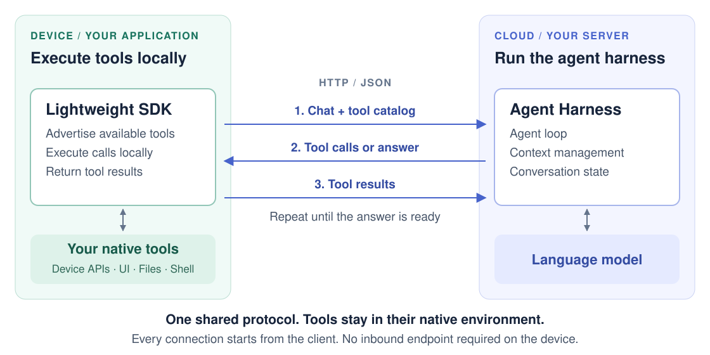

# JAgentHarness

**English** | [简体中文](README.zh-CN.md)

**Run the agent harness remotely. Execute tools locally.**

JAgentHarness is an agent harness designed for server deployment, with tool execution separated from the agent runtime. Your application embeds a lightweight tool-execution SDK; a server runs the harness, calls the model, and maintains the conversation. A shared protocol connects them.



The client initiates every connection. The server returns tool calls in its responses, so the device does not need to expose a callback endpoint.

## Why separate the harness from execution?

A robot controller, a phone app, and a desktop application each have their own runtime, dependencies, and native APIs. The tools must run there, but embedding a full agent harness can tie the application to a different language, framework, or dependency stack. Reimplementing the agent loop for each environment adds another system to maintain.

JAgentHarness puts a protocol at that boundary. **The device implements its capabilities; the server runs the agent.** Model integration, context management, and conversation state live on the server. Local code owns tool implementations, permissions, and execution. Agent behavior can evolve independently of those device integrations.

## Where this fits

| Application | What stays local |
| --- | --- |
| Coding and desktop automation | Workspace access, application controls, shell commands |
| Robot control | Hardware drivers, sensor access, device-specific actions |
| Phone automation | Native app integration, UI actions, platform permissions |
| Existing business applications | Internal services and operations exposed as tools |

**Available today:** a Java server, lightweight Java client SDK, and a working coding demo. Robot and phone integrations illustrate applications of the design; their platform tools and adapters are not included. A complete JavaScript SDK is not yet provided.

## Features

- **Built for servers:** a deployable Java agent with model integration, streaming, context compaction, and tool orchestration.
- **Database-backed state:** persist conversations, execution events, and usage through JDBC, with your choice of database.
- **Virtual file system:** manage prompts, skills, and supporting files in the database, with global and project scopes.
- **Lightweight client SDK:** embed native tools into existing applications with just JDK HTTP and Jackson; connect through a language-neutral protocol.
- **Extensible by design:** combine server, client, and MCP tools; customize model providers, prompts, and storage through Maven libraries.

## Try it locally

You need **JDK 8+**, **Maven 3.6.3+**, **Node.js 22.12+**, and an OpenAI-compatible model endpoint. SQLite is included; no database service is needed.

```sh
git clone https://github.com/differentialmanifold/jagent-harness.git
cd jagent-harness
cp .env.example .env.local
```

Set your model connection in `.env.local`:

```dotenv
JAGENT_MODEL=your-model-name
JAGENT_OPENAI_BASE_URL=https://your-provider.example/v1
JAGENT_OPENAI_API_KEY=your-api-key
```

Start the coding demo:

```sh
node scripts/dev.mjs
```

This builds and starts the harness server, coding client, and web console. Open **http://127.0.0.1:5175**, create a project with a local workspace path, and ask:

> Read the README in this workspace and summarize the project.

Watch the tool calls: the server drives the conversation while the coding client reads the file on your machine. In a scratch workspace, try asking it to create a small file and read it back. Use the console's approval controls for local actions. **Ctrl+C** stops the demo.

To see the same separation across machines, set `JAGENT_SERVER_URL` and `JAGENT_CLIENT_TOKEN` to an existing server, then run `node scripts/dev.mjs --client-only`. The workspace remains on the client machine.

See [Quick start](QUICK_START.md) for separate component launchers, Windows/macOS shortcuts, manual startup commands, and troubleshooting.

## Integrate it

- [Java client SDK](sdk/java/README.md): embed tool execution and register local capabilities.
- [HTTP/JSON protocol](protocol/README.md): implement a client in another language or environment.
- [Server integration](jagent-harness-sdk/README.md): host and configure the harness using Maven libraries.
- [Coding client](examples/coding-java/README.md) and [server host](examples/server-demo/README.md): the two applications behind the demo.

This source tree targets `1.1.0`. For local development, run `mvn install` before building a separate Maven consumer. The current host targets a single service instance and application-level authentication; platform-specific permissions remain the client's responsibility.

## Development

```sh
mvn clean install
npm ci --prefix protocol
npm test --prefix protocol
npm ci --prefix console
npm test --prefix console
npm run build --prefix console
```

Maven runs the Java tests; npm runs the protocol and console tests. See [Releasing](RELEASING.md) for artifact publication.

[MIT License](LICENSE).
